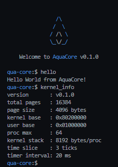

# AquaCore

<p>
  
</p>

AquaCoreは、RISC-V 32bit向けに開発しているマイクロカーネルです。  
QEMU + OpenSBI 環境での動作を前提に実装しています。

<p>
  
</p>

## ビルド/起動
### 前提
- `clang` / `lld` / `llvm-objcopy`
- `qemu-system-riscv32`
- `python3`（integration test 実行時に使用）
- Linux で TAP 利用時は `ip` / `iptables` / `sudo`（必要に応じて）
- OpenSBIバイナリのリポジトリトップへの設置が必要です  
  ```
  cd Aqua-Core
  curl -LO https://github.com/qemu/qemu/raw/v8.0.4/pc-bios/opensbi-riscv32-generic-fw_dynamic.bin
  ```

### Makefile
```bash
# build (kernel + user apps)
make

# run on qemu with TAP network (create ./bin/disk.img when missing)
make run
```

主要ターゲット:

- `make` or `make build` : ビルド
- `make start`: QEMU起動
- `make run` : ビルド + QEMU起動
- `make run-usernet` : ビルド + QEMU起動（QEMU user-mode net）
- `make run-tap` : ビルド + QEMU起動（TAP net）
- `make tap-up` / `make tap-down` : TAPデバイス作成/削除
- `make nat-up` / `make nat-down` : TAP向けNAT有効化/無効化
- `make clean` : 生成物削除（disk imageは残す）
- `make distclean` : 生成物 + `./bin/disk.img` 削除

## テスト実行

```bash
# unit test
make test-unit

# integration test (QEMU起動)
make test-int

# unit + integration
make test
```

- unit test はケースごとに `[PASS]/[FAIL]` を表示します。
- integration test もケースごとに `[PASS]/[FAIL]` を表示します。
- integration 失敗時は `tests/int/last_failure.log` に以下を出力します。
  - 実行コマンド
  - エラー内容
  - ケース履歴（`START/PASS/FAIL`）
  - QEMU出力末尾

## 現在の実装機能

- ブートストラップ
  - `stvec` 設定
  - S-mode trap 入口 (`kernel_entry`) 実装
  - Supervisor Timer Interrupt 有効化
- Trap/割り込み
  - U-mode `ecall` 処理 (syscall)
  - timer 割り込みでの再スケジュール判定
  - syscall 引数のユーザメモリアクセス安全化（`copyin` / `copyout` / `copyinstr`）
- 入力処理
  - コンソール入力リングバッファ
  - `getchar` の待機/起床制御（busy loop回避）
- メモリ管理
  - ページ単位 bitmap allocator (`alloc_pages` / `free_pages`)
  - SV32 2段ページテーブル構築とマッピング
- プロセス管理/スケジューリング
  - プロセス作成 (`create_process`)
  - `fork` / `exec` / `execv`（引数付き実行）
  - タイムスライス付きラウンドロビン (`yield`)
  - 終了プロセスの回収 (`reap_exited_processes`, `waitpid`)
  - `kill` / `waitpid`
- IPC
  - プロセスごとの単一 mailbox
  - `ipc_send` / `ipc_recv` による送受信
- ネットワーク
  - virtio-net 初期化（MMIO）
  - ARP 解決
  - ICMP Echo 送受信（`ping`）
  - UDP 送信（`udp_send`）
  - DNS クエリ送信（`nslookup`）
- ファイルシステム (VFS)
  - `/` : PFS（virtio-blk上の永続ストレージ）
  - `/tmp` : RAMFS（揮発ストレージ）
  - `/proc` : RAMFSベース procfs (`/proc/<pid>/status`)
  - `ls` / `cat` / `write` / `mkdir` / `rm` などのファイル操作
  - `dup2` と shell リダイレクト（`<`, `>`）
- カレントディレクトリ
  - プロセスごとの `cwd` / `root` 管理
  - `cd` と相対パス解決（`cat`, `rm`, `write`, `touch`, `mkdir`, `rmdir` など）
- RTC/時刻
  - Goldfish RTC ドライバによる現在時刻取得
  - `gettime` syscall と shell `date` コマンド
- shell UX
  - コマンド履歴（保存/復元）
  - 履歴の上下キー参照
  - 左右キーでカーソル移動、途中挿入/削除（Backspace/Delete）
  - Tab 補完（App名）
- ユーザアプリ
  - `shell`, `ps`, `date`, `ls`, `mkdir`, `rmdir`, `touch`, `rm`, `write`, `cat`, `kill`, `kernel_info`, `bitmap`, `ping`, `udp_send`, `nslookup`, `ipc_rx`
  - shell 組み込み: `cd`, `history`, `exit`
- テスト基盤
  - host 実行の unit test（`tests/unit`）
  - QEMU 実行の integration test（`tests/int`）
  - 各 user app の最低1回実行を含む自動確認
  - `kernel_info` 出力の数値妥当性チェック
- カーネル終了
  - init プロセス終了時の shutdown 処理

## ドキュメント

- [Documentation Index](./docs/README.md)
- [Linker Script](./docs/linker-script.md)
- [Kernel Bootstrap](./docs/kernel-bootstrap.md)
- [Trap Handler](./docs/trap-handler.md)
- [Mode Transition](./docs/mode-transition.md)
- [Syscall](./docs/syscall.md)
- [Memory / Process](./docs/memory-process.md)
- [Process Management](./docs/process-management.md)
- [Fork / Exec](./docs/fork-exec.md)
- [Execv Argument Passing](./docs/execv-args.md)
- [Shell Redirection](./docs/shell-redirection.md)
- [VFS / RAMFS / VirtIO Block Storage](./docs/vfs.md)
- [Procfs (`/proc` on RAMFS)](./docs/procfs.md)
- [RTC / Time Syscall](./docs/rtc.md)
- [Memory Map](./docs/memory-map.md)
- [SV32 Paging](./docs/sv32.md)
- [Page Table Mapping Path](./docs/page-table-path.md)
- [Kernel Operation Walkthrough](./docs/kernel-operation-walkthrough.md)
