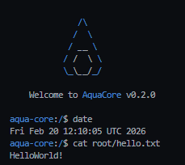
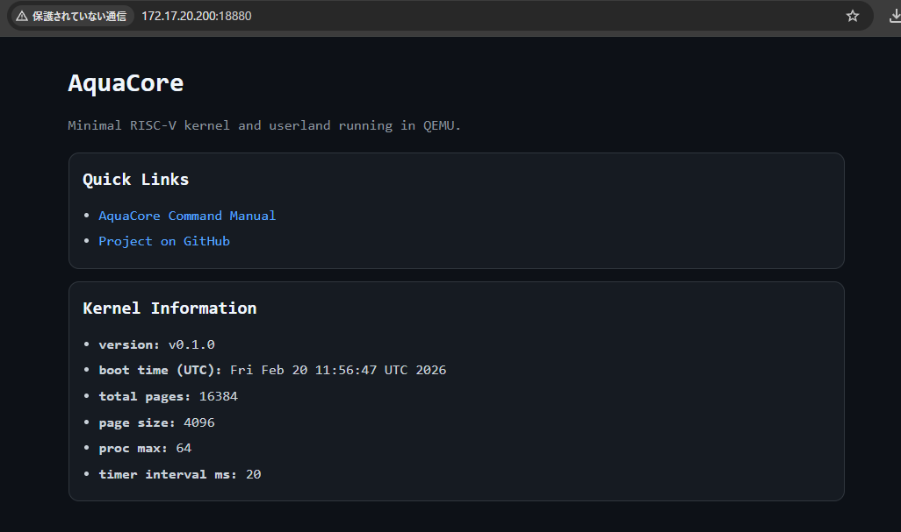

# AquaCore

<p>
  
</p>

AquaCore は、RISC-V 32bit (`qemu-system-riscv32`) 上で動作するマイクロカーネルです。  
現在の実装は、プロセス/トラップ/システムコール/VFS/ネットワーク/ユーザアプリ実行までを含みます。

## 実装機能

### カーネルコア機能

- ブート/トラップ
- タイマ割り込みとプリエンプティブスケジューリング
- プロセス管理（`fork` / `exec_path` / `execv_path` / `exit(status)` / `waitpid(status回収)` / `kill`）
- ユーザメモリアクセス保護（`copyin` / `copyout` / `copyinstr` と `SSTATUS_SUM` ラップ）
- VFS 層
- 永続 FS: `pfs`（virtio-blk 上、dirty block 同期）
- 揮発 FS: `ramfs` (`/tmp`)
- `procfs` (`/proc/<pid>/status` の動的生成)
- AppFS（`/bin/*` 実行イメージをディスクからロード）
- ソケット API（`socket` / `bind` / `sendto` / `recvfrom` / `connect` / `listen` / `accept`）
- ネットワーク（virtio-net、ICMP ping、UDP、TCP）
- RTC 時刻取得
- 組み込み HTTP サーバ（静的ファイル配信、`index.html`/`manual.html` 自動生成）

### ユーザアプリ

- `shell`
  <p>
    
  </p>
- `ipc_rx`
- `ps`
- `date`
- `ls`
- `mkdir`
- `rmdir`
- `touch`
- `rm`
- `write`
- `cat`
- `kill`
- `kernel_info`
- `bitmap`
- `ping`
- `udp_send`
- `nslookup`
- `echo`
- `edit`
- `curl`
- `http_server`  

  <p>
    
  </p>

## リポジトリ構成（主要）

- `src/kernel/` カーネル本体
- `src/user/` ユーザランタイム/ユーザアプリ
- `src/lib/` 共通ライブラリ
- `tests/unit/` ホスト実行のunit test
- `tests/int/` QEMU実行のintegration test
- `docs/kernel/` カーネル機能ドキュメント

## 必要ツール

- `clang`（RISC-Vターゲット付き）
- `lld`
- `llvm-objcopy`
- `qemu-system-riscv32`
- `python3`
- （TAP/NAT運用時）`ip`, `iptables`, `sudo`
- OpenSBIバイナリ(リポジトリトップへの設置が必要です)  
  ```
  cd Aqua-Core
  curl -LO https://github.com/qemu/qemu/raw/v8.0.4/pc-bios/opensbi-riscv32-generic-fw_dynamic.bin
  ```

## ビルド

```bash
make build
```

生成物:

- カーネルELF: `bin/kernel.elf`
- ディスクイメージ: `bin/disk.img`（`make disk` または `run/start/test-int` で自動作成）

## 実行

### 1. 通常実行（TAP ネットワーク）

```bash
make run
```

### 2. user-mode networking で実行

```bash
make run-usernet
```

### 3. GDB 待ち受けで起動

```bash
make qemu-debug
```

- `make run` は `kernel.elf` と `disk.img` を必要に応じて更新して起動します。
- `make start` は `disk` を準備して起動します。`kernel.elf` が無い完全初回のみ自動ビルドが走ります。

## テスト

### Unit test

```bash
make test-unit
```

- `tests/unit/test_commonlibs.c`
- `tests/unit/test_user_path.c`

### Integration test (QEMU)

```bash
make test-int
```

実行スクリプト: `tests/int/run_qemu_tests.py`

### 全テスト

```bash
make test
```

## Make ターゲット早見

- `make build` カーネルとユーザアプリをビルド
- `make disk` `bin/disk.img` を作成し appfs をパック
- `make run` QEMU 実行（TAP、`kernel` + `disk` 依存）
- `make start` QEMU 実行（`disk` 依存）
- `make run-usernet` usernet で QEMU 実行
- `make start-usernet` usernet で QEMU 実行（`disk` 依存）
- `make qemu-debug` GDB 待ち受け付き起動
- `make qemu-debug-usernet` usernet + GDB 待ち受け
- `make run-tap` / `make start-tap` TAP 明示実行
- `make qemu-debug-tap` TAP + GDB 待ち受け
- `make run-tap-dump` TAP パケットダンプ取得
- `make test-unit` unit test実行
- `make test-int` integration test実行
- `make test` 全テスト実行
- `make clean` ビルド成果物を削除
- `make distclean` `clean` + `bin/disk.img` を削除

## ネットワーク補助ターゲット（TAP/NAT）

- `make tap-up` / `make tap-down` / `make tap-status`
- `make nat-up` / `make nat-down` / `make nat-status`

環境変数で変更可能:

- `TAP_DEV`（default: `tap0`）
- `TAP_ADDR`（default: `10.0.2.1/24`）
- `TAP_CIDR`（default: `10.0.2.0/24`）
- `WAN_DEV`（default: `wlan0`）
- `PORTFWD_HOST_PORT`（default: `18880`）
- `PORTFWD_GUEST_IP`（default: `10.0.2.15`）
- `PORTFWD_GUEST_PORT`（default: `8080`）

`NET_BACKEND=user` で `make run`/`make start` を使う場合は、`QEMU_HOSTFWD` で QEMU usernet 側のポート転送も設定できます。

## 関連ドキュメント

- カーネル機能ドキュメント: `docs/kernel/README.md`
- 実行フロー（AppFS）: `docs/appfs-exec-flow.md`
- `execv` 引数関連: `docs/execv-args.md`

## ライセンス

`LICENSE` を参照してください。
