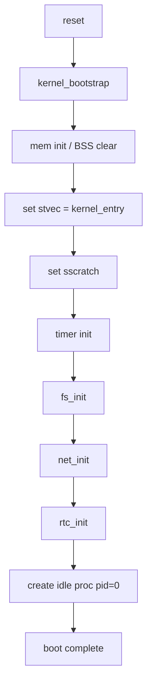
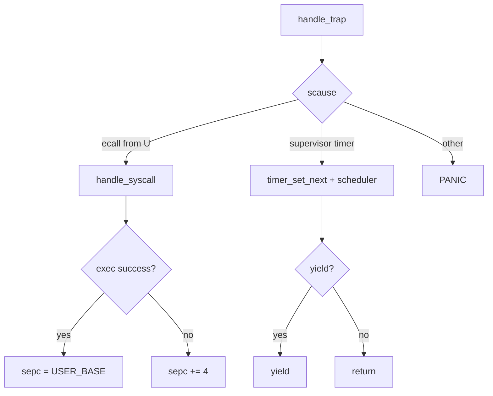

# Boot / Trap (Draft)

## 1. 概要
- カーネル起動、トラップエントリ、例外/割り込みハンドリングの現行実装をまとめる。
- 主要コード: `src/kernel/kernel.c`, `src/kernel/trap/trap_handler.c`, `src/kernel/trap/syscall_handler.c`

## 2. ブートフロー
1. `kernel_bootstrap()` が起動。
2. BSS クリア後に `memory_init()` 実行。
3. `stvec` に `kernel_entry` を設定。
4. `sscratch` にカーネルSPを設定。
5. タイマ割り込み有効化 (`enable_timer_interrupt`, `timer_set_next`)。
6. `fs_init()` / `net_init()` / `rtc_init()` を初期化。
7. idleプロセス (`pid=0`) 作成、`current_proc=idle_proc`。
8. カーネル情報を表示。

## 3. 図解: ブートシーケンス


## 4. Trap Entry (`kernel_entry`)
- U-mode 由来トラップ時のみ `sp` と `sscratch` を swap。
- 割り込み禁止 (`sstatus.SIE` クリア) でネスト破壊を回避。
- 汎用レジスタを `trap_frame` 形式で保存し `handle_trap()` 呼び出し。
- 復帰時にレジスタ復元後 `sret`。

## 5. 図解: レジスタ退避/復帰の詳細
### 5.1 trap entry 時
```text
(U-mode trap)
  sp(user) ----csrrw sp,sscratch,sp----> sp(kernel)
                     |
                     +-> sscratch = old sp(user)

  csrc sstatus, SIE
  addi sp, sp, -(31 * 4)
  [sp+0]   = ra
  [sp+4]   = gp
  ...
  [sp+29*4]= s11
  [sp+30*4]= old sp (from sscratch)

  a0 = sp (trap_frame*)
  call handle_trap(a0)
```

### 5.2 trap return 時
```text
  restore ra..s11 from trap_frame
  lw sp, [sp + 30*4]   // saved original sp
  sret                 // sepc/sstatusに従って復帰
```

## 6. Trap Dispatch (`handle_trap`)
- `scause/stval/sepc/sstatus` を読み取り。
- U-mode 由来なら `process_from_trap_frame()` で所有プロセスを解決。
- `SCAUSE_ENVIRONMENT_CALL_FROM_U_MODE`:
  - `handle_syscall()` 呼び出し。
  - `exec_path/execv_path` 成功時は `sepc=USER_BASE`、それ以外は `sepc += 4`。
- `SCAUSE_SUPERVISOR_TIMER`:
  - 次タイマ設定、コンソールpoll、スケジューラtick処理。
  - 必要なら `yield()`。
- その他例外は現状 `PANIC`。

## 7. 図解: trap dispatch


## 8. Syscall 分配
- `handle_syscall()` が `a3` (sysno) で分岐。
- 主カテゴリ:
  - コンソール (`putchar/getchar`)
  - プロセス (`exit/ps/waitpid/fork/exec*`)
  - IPC (`ipc_send/ipc_recv`)
  - FS (`open/read/write/...`)
  - 時刻 (`gettime/sleep`)
  - ネット (`ping_tx`)

## 9. 既知制約
- 多くの異常トラップは kill/recover せず即 `PANIC`。
- `sepc` 更新ロジックは `exec*` を特別扱いする実装依存。
