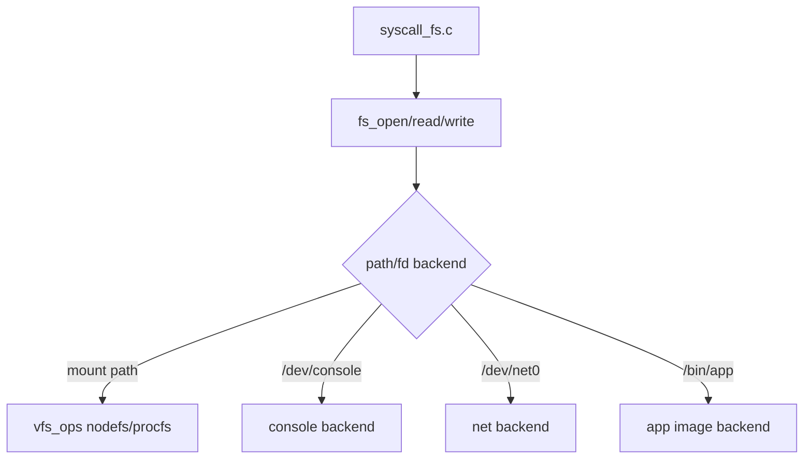

# Filesystem / VFS (Draft)

## 1. 概要
- VFS層、`pfs/ramfs/procfs`、`/bin` appfs読込の現行実装。
- 主要コード: `src/kernel/fs/fs.c`, `src/kernel/fs/pfs.c`, `src/kernel/fs/ramfs.c`, `src/kernel/fs/procfs.c`

## 2. レイヤ構成
- VFS:
  - mount table (`mounts[]`)
  - per-process FD table (`fd_table[pid][fd]`)
  - `vfs_ops` 経由で backend 呼び出し
- NodeFS系 backend:
  - 共通データ: `struct nodefs`
  - rootfs: persistent (`pfs`)
  - tmpfs: volatile (`ramfs`)
  - procfs: 専用 `vfs_ops` (read-only)

## 3. 図解: VFSレイヤ


## 4. マウント初期化 (`fs_init`)
1. FD/mount表を初期化。
2. blockdev (virtio-blk) 初期化。
3. rootfs を pfs からロード。
4. tmpfs/procfs を初期化。
5. appfs (`/bin`) エントリ読込。
6. mount:
   - `/` -> rootfs
   - `/tmp` -> tmpfs
   - `/proc` -> procfs
7. `/bin` ディレクトリをrootfs上に確保。

## 5. 図解: mount tree
```text
/
|- bin      (directory on rootfs, file content from appfs image)
|- tmp      (mounted tmpfs)
`- proc     (mounted procfs)
```

## 6. /bin 実行イメージ
- appfsメタデータを blockdev 上からロード。
- `fs_open("/bin/<name>")` は app image backend (`FD_BACKEND_APPIMG`) を返す。
- `fs_read` は blockdevから該当オフセットを直接読む。
- app image は read-only。

## 7. 図解: /bin 読み込み経路


## 8. procfs
- ディレクトリ構造:
  - `/proc/<pid>/status`
- `status` 内容:
  - pid/ppid/name/state/wait_reason/exit_code/cwd 等
- `readdir("/proc")` で稼働中PIDを列挙。
- 書き込み系 (`mkdir/write/unlink/rmdir`) は未サポート。

## 9. 図解: procfs view
```text
/proc
|- 1/
|  `- status
|- 2/
|  `- status
`- ...
```

## 10. pfs 永続化
- `struct pfs_image { magic, nodes[] }` を blockdev に保存。
- dirty block bitmap による差分同期 (`KERNEL_PFS_SYNC_MODE_DIRTY`)。
- ノード更新時に `pfs_mark_dirty_*`、適宜 `pfs_sync()`。

## 11. 図解: dirty block 同期
```text
node update -> mark dirty block(s) -> fs_close/sync point -> blockdev_write(dirty only)
```

## 12. FDと標準入出力
- `fs_init_process_stdio(pid)` で `0/1/2` を console backend に設定。
- `dup2`, `fork` 時のFDコピーをサポート。

## 13. 既知制約
- inode番号やリンク数等のPOSIX互換メタデータは未実装。
- path正規化 (`..`, シンボリックリンク) は限定的。
