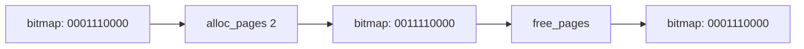
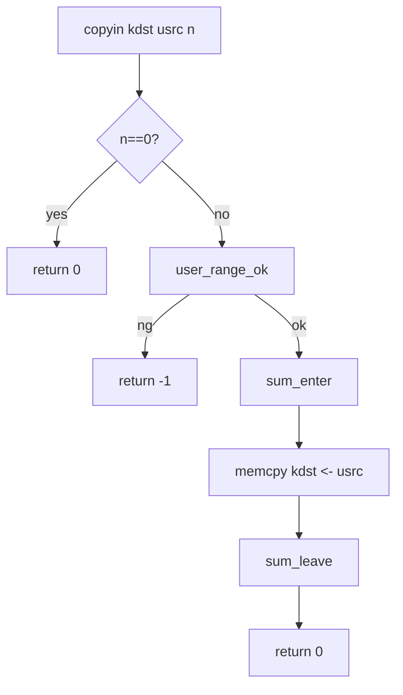

# Memory (Draft)

## 1. 概要
- 物理ページアロケータとページマッピングの現行実装。
- 主要コード: `src/kernel/mm/memory.c`, `src/kernel/trap/page_access.c`

## 2. ページアロケータ
- 管理対象: `__free_ram` から `__free_ram_end`。
- 管理方式: ビットマップ (`page_bitmap`)。
- `memory_init()`:
  - 総ページ数計算。
  - ビットマップ領域を先頭に確保。
  - 残りを alloc/free 管理領域に設定。
- `alloc_pages(n)`:
  - 連続空きページを first-fit で探索。
  - 確保ページはゼロクリア。
- `free_pages(paddr, n)`:
  - 範囲/整列/二重解放を検証して解放。

## 3. 図解: 物理メモリレイアウト
```text
+-----------------------------+  __free_ram
| page_bitmap (N pages)       |
+-----------------------------+  managed_base
| managed physical pages      |
|  page 0                     |
|  page 1                     |
|  ...                        |
+-----------------------------+  __free_ram_end
```

## 4. 図解: alloc/free の状態遷移


## 5. ページテーブル
- `map_page(table1, vaddr, paddr, flags)`:
  - SV32 の2段テーブル前提。
  - 1段目未作成なら新規ページ確保。
  - PTEを `flags | PAGE_V` で設定。

## 6. 図解: SV32 2段マッピング
```text
vaddr
 31........22 21........12 11........0
 [  vpn1   ] [   vpn0   ] [ page off ]
      |             |
      v             v
  table1[vpn1] --> table0
                    |
                    +--> table0[vpn0] = paddr | flags | V
```

## 7. ユーザメモリアクセス補助
- `sum_enter()/sum_leave()` で `SSTATUS_SUM` を安全に一時有効化。
- `copyin/copyout/copyinstr`:
  - `USER_BASE`〜`USER_BASE + user_pages*PAGE_SIZE` の範囲チェック。
  - オーバーフローとNULLを検出。

## 8. 図解: SUMラップと退避復元
```text
uint32_t saved = READ_CSR(sstatus)
WRITE_CSR(sstatus, saved | SSTATUS_SUM)
    ... user memory access ...
WRITE_CSR(sstatus, saved)
```

## 9. 図解: copyin/copyout/copyinstr 詳細
### 9.1 copyin


### 9.2 copyout
```text
Kernel buffer (ksrc) --memcpy--> User buffer (udst)
                   with SUM=1 only inside critical section
```

### 9.3 copyinstr
```text
for i in [0..max-1]:
  user_range_ok(usrc+i,1)
  c = usrc[i]
  kdst[i] = c
  if c == '\0': success
(no terminator in max bytes => fail)
```

## 10. 既知制約
- 高度なVM機能 (COW, demand paging, swap) は未実装。
- OOM時は復旧せず `PANIC`。
