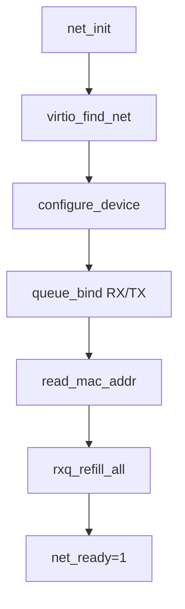
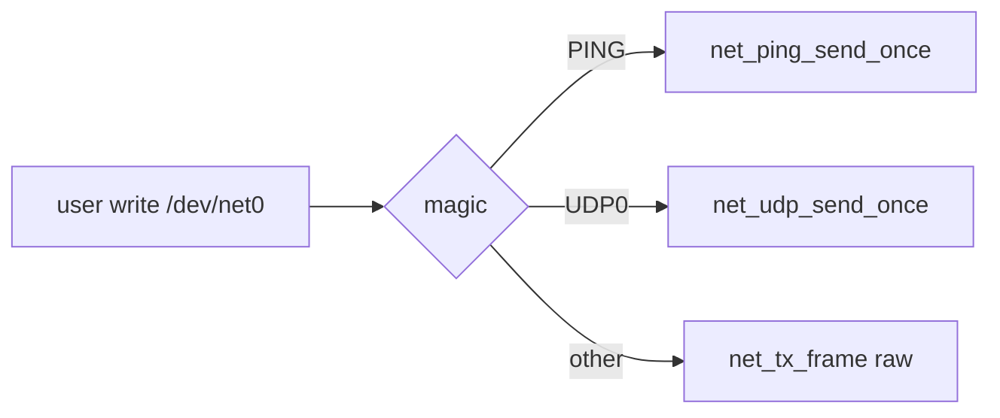

# Network (Draft)

## 1. 概要
- virtio-net初期化、送受信、ping/udp補助の現行実装。
- 主要コード: `src/kernel/net/net_virtio.c`, `src/kernel/net/net_dev.c`, `src/kernel/net/ping.c`, `src/kernel/net/udp.c`

## 2. デバイス初期化
- `net_init()`:
  - virtio-net MMIOデバイス探索
  - feature negotiation (VERSION_1 + optional MAC)
  - RX/TX queue設定
  - MACアドレス取得
  - RX queue 事前投入 (`rxq_refill_all`)

## 3. 図解: virtio-net 初期化


## 4. フレーム送受信
- `net_tx_frame(buf,len)`:
  - virtio-net header + payload の2desc chainで送信。
  - used ring更新をポーリング待ち。
- `net_rx_try_dequeue(&frame,&len)`:
  - 受信キューからフレーム取り出し。

## 5. 図解: TX descriptor chain
```text
desc[0]: virtio_net_hdr (NEXT=1)
   -> desc[1]: frame payload
avail ring push -> notify queue 1 -> wait used.idx advance
```

## 6. /dev/net0 経由API
- `fs_open("/dev/net0")` で net backend FD。
- `fs_write`:
  - magic `PING` 形式なら `net_ping_send_once`
  - magic `UDP0` 形式なら `net_udp_send_once`
  - それ以外は raw frame 送信
- `fs_read`:
  - 受信フレームをユーザバッファへコピー

## 7. 図解: /dev/net0 write dispatch


## 8. ICMP ping
- `net_ping_send_once(dst,id,seq)`:
  - ARPでMAC解決
  - ICMP Echo Request生成・送信
  - Echo Replyをポーリング待機

## 9. 図解: ping 送受信
```text
resolve arp -> build icmp echo -> tx -> poll rx queue -> match echo reply(id,seq)
```

## 10. 既知制約
- 割り込み駆動ではなくポーリング主体。
- 高度なソケット抽象化/複数キュー最適化は未実装。
