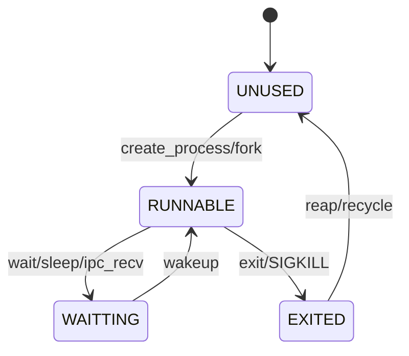
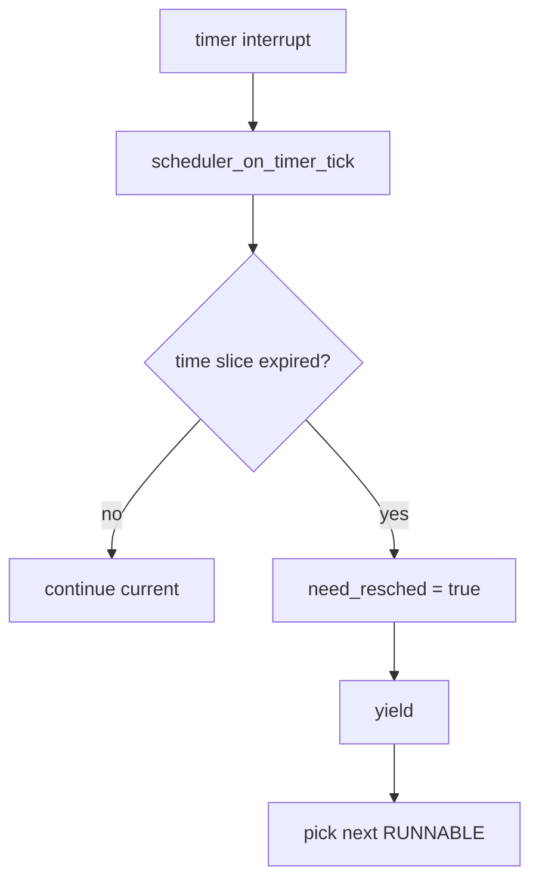

# Process / Scheduler (Draft)

## 1. 概要
- プロセス生成、終了、待ち合わせ、スケジューリングの現行実装。
- 主要コード: `src/kernel/proc/process.c`, `src/include/proc/process.h`

## 2. プロセスモデル
- テーブル固定長: `procs[PROCS_MAX]`。
- 主状態:
  - `PROC_UNUSED`
  - `PROC_RUNNABLE`
  - `PROC_WAITTING`
  - `PROC_EXITED`
- 主付帯情報:
  - 親子関係 (`parent_pid`)
  - 終了コード (`exit_code`)
  - IPC mailbox
  - exec引数 (`exec_argc/exec_argv`)
  - cwd/root情報

## 3. 図解: プロセス状態遷移


## 4. 主要ライフサイクル
- 生成: `create_process()`
- 複製: `process_fork()`
- 置換: `process_exec()`
- 終了: `exit` syscall -> `PROC_EXITED`
- 回収:
  - 親なし (`parent_pid==0`) は即 recycle 対象
  - 親ありは zombie として残し `waitpid` で回収

## 5. スケジューラ
- タイマtickで `scheduler_on_timer_tick()` 実行。
- `SCHED_TIME_SLICE_TICKS` で time slice 管理。
- `scheduler_should_yield()` 真なら `yield()`。
- `switch_context(prev_sp, next_sp)` でSレジスタ群+`sstatus`を切替。

## 6. 図解: context switch での退避/復帰
```text
switch_context(prev_sp, next_sp)
  save: ra,s0..s11 -> current stack
  save: sstatus     -> current stack
  *prev_sp = sp
  sp = *next_sp
  restore: sstatus
  restore: ra,s0..s11
  ret
```

## 7. 図解: scheduler tick


## 8. wait/signal
- `wait_for_child_exit(parent_pid, target_pid, options, &exit)`:
  - `WAITPID_NOHANG` をサポート。
- `SIGKILL`:
  - 対象を終了させ orphan 処理。
- `SIGCHLD`:
  - 親が wait 中でなければカーネル側回収を試行。

## 9. procfs 連携
- 主要イベントで `procfs_sync_process()` を呼び、`/proc/<pid>/status` を更新。
- recycle時は `procfs_cleanup()` を実行。

## 10. 既知制約
- スケジューリングは単純ラウンドロビン系。
- リアルタイム優先度やCPU affinityは未実装。
