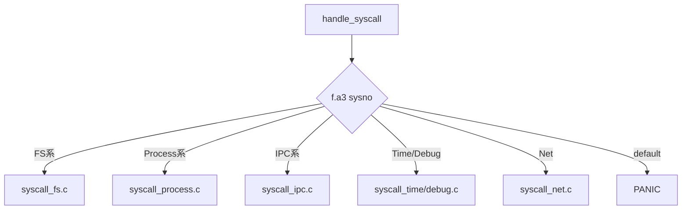
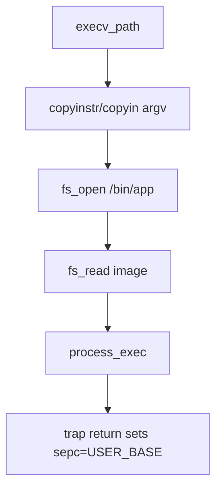

# Syscall (Draft)

## 1. 概要
- syscall ABI、dispatch、カテゴリ別ハンドラの実装まとめ。
- 主要コード: `src/kernel/trap/syscall_handler.c`, `src/kernel/trap/syscall_*.c`

## 2. ABI
- ユーザ側 `ecall` 呼び出し規約:
  - `a3`: syscall番号
  - `a0/a1/a2`: 引数
  - 返値: `a0`
- ユーザラッパ: `src/user/runtime/user_syscall.c`

## 3. 図解: ecall ABI
```text
User:
  a0=arg0, a1=arg1, a2=arg2, a3=sysno
  ecall
Kernel:
  trap_frame.a0..a3 を読み、ハンドラ実行
Return:
  trap_frame.a0 を戻り値として user に返す
```

## 4. Dispatch
- `handle_syscall(struct trap_frame *f)` が `f->a3` で分岐。
- 未定義番号は `PANIC("undefined system call")`。

## 5. 図解: syscall dispatch


## 6. 実装カテゴリ
- Console: `SYSCALL_PUTCHAR`, `SYSCALL_GETCHAR`
- Process: `EXIT`, `PS`, `WAITPID`, `KILL`, `FORK`, `EXEC_PATH`, `EXECV_PATH`, `GETARGS`
- FS: `OPEN/CLOSE/READ/WRITE/MKDIR/READDIR/UNLINK/RMDIR/DUP2/GETCWD/CHDIR`
- IPC: `IPC_SEND`, `IPC_RECV`
- Time/Debug: `GETTIME`, `SLEEP`, `KERNEL_INFO`, `BITMAP`
- Network: `PING_TX`

## 7. copyin/out/instr 方針
- ユーザポインタ引数は直接参照せず `copyin/copyout/copyinstr` を使用。
- `copyinstr` でpath等をカーネルバッファへ取り込んでから処理。
- `read/write` は固定長カーネルバッファを経由し分割転送。

## 8. 図解: read syscall のコピー経路
```text
user_buf <---copyout--- kbuf <---fs_read--- backend(file/dev)
   ^                           (loop by chunk)
   +---- return bytes done ----+
```

## 9. exec syscall の流れ
1. ユーザからpath/argvを `copyinstr`/`copyin`。
2. `fs_open/fs_read` で実行イメージ読込。
3. `process_exec(image, size, name, argc, argv)`。
4. trap復帰側で `sepc=USER_BASE` へ更新。

## 10. 図解: exec 系


## 11. 既知制約
- 無効syscall番号でプロセスkillではなくカーネルpanic。
- 引数検証は各ハンドラごとで統一層は未導入。
