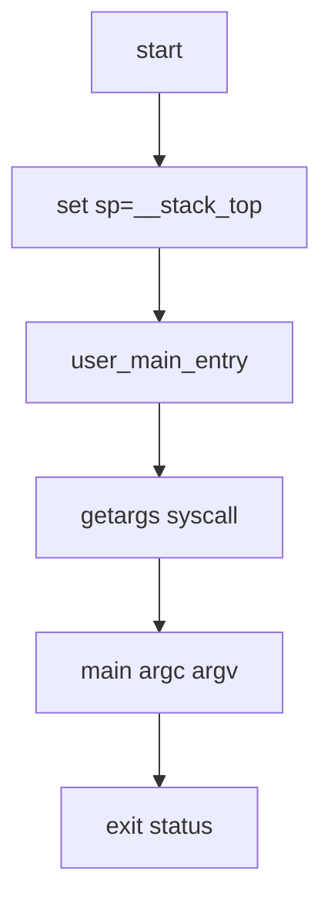

# User Runtime / App Launch (Draft)

## 1. 概要
- ユーザランタイム起動点、syscallラッパ、exec引数受け渡しの現行実装。
- 主要コード: `src/user/runtime/user.c`, `src/user/runtime/user_syscall.c`, `src/kernel/trap/syscall_process.c`

## 2. ユーザ起動シーケンス
1. `start` (`.text.start`) が `sp=__stack_top` を設定。
2. `user_main_entry()` 呼び出し。
3. `getargs()` で `exec_args` 取得。
4. `main(argc, argv)` 実行。
5. 戻り値を `exit(status)` に渡して終了。

## 3. 図解: ユーザ開始フロー


## 4. syscallラッパ
- 共通関数 `syscall(sysno,arg0,arg1,arg2)` が `ecall` を発行。
- FS, Process, IPC, Time, Network それぞれ薄いラッパ関数を提供。

## 5. 図解: user->kernel syscall
```text
user wrapper -> ecall
           trap
kernel handle_trap -> handle_syscall -> syscall handler
           return a0
user continues
```

## 6. exec 系フロー
- ユーザAPI:
  - `exec_path(path)`
  - `execv_path(path, argv)`
- カーネル側:
  - path/argvを `copyinstr/copyin`。
  - `/bin/<app>` などから実行イメージを読み込み。
  - `process_exec()` で現在プロセスのイメージを置換。

## 7. 図解: execv 引数の流れ
```mermaid
flowchart LR
    A[user argv[] pointers] --> B[copyin pointer array]
    B --> C[copyinstr each arg]
    C --> D[process.exec_argv 保存]
    D --> E[getargs in new image]
    E --> F[main argc argv]
```

## 8. 引数受け渡し
- カーネルは `process.exec_argc/exec_argv` に保持。
- `SYSCALL_GETARGS` でユーザへコピー。
- runtime が `argv[]` を組み立て `main` に渡す。

## 9. 既知制約
- libc相当は最小限で、POSIX互換層は限定的。
- 動的リンクやELFローダは未実装。
