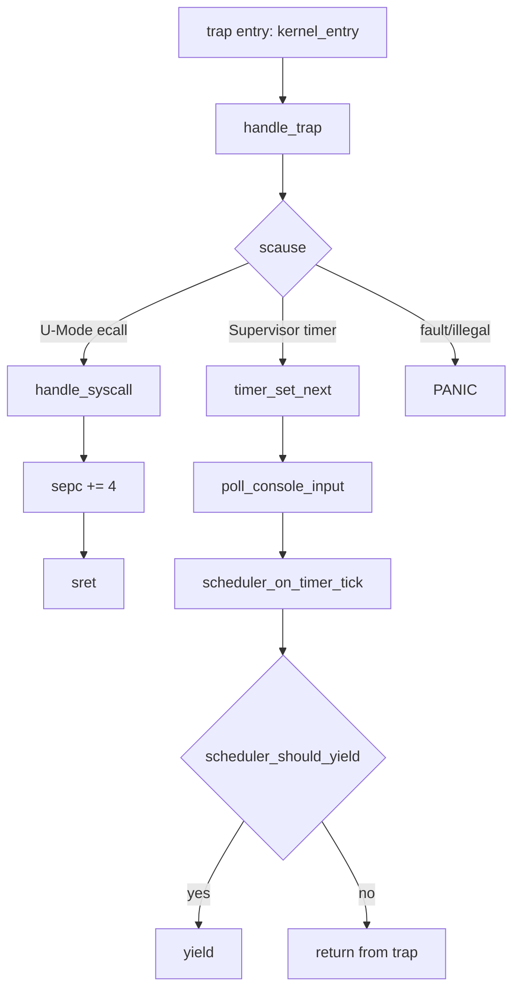

# Trap Handler

対象: `src/kernel/trap/trap_handler.c`

関連:

- [Mode Transition](./mode-transition.md)
- [Memory / Process](./memory-process.md)
- [Syscall](./syscall.md)

## 処理フロー (mermaid)



## 処理フロー (text)

```text
U-Mode
  ecall / timer
    |
    v
kernel_entry (save regs, swap sp/sscratch)
    |
    v
handle_trap
  |- scause=ecall  -> handle_syscall -> sepc+=4 -> sret
  |- scause=timer  -> timer_set_next
  |                 -> poll_console_input
  |                 -> scheduler_on_timer_tick
  |                 -> [need_resched] yield
  |                 -> return
  `- otherwise      -> PANIC
```

## U-Mode ecall

```c
case SCAUSE_ENVIRONMENT_CALL_FROM_U_MODE:
    handle_syscall(f);
    user_pc += 4;
    break;
```

- `handle_syscall` に処理委譲
- `ecall` 再実行回避のため `sepc += 4`

## timer interrupt

```c
case SCAUSE_SUPERVISOR_TIMER:
    timer_set_next();
    poll_console_input();
    scheduler_on_timer_tick();
    if (scheduler_should_yield()) {
        yield();
    }
    return;
```

- 次回 timer を先に再設定
- console 入力を吸い上げ
- タイムスライスが尽きた時だけ `yield()`

## 例外処理

未対応 fault は `PANIC` で停止します。
